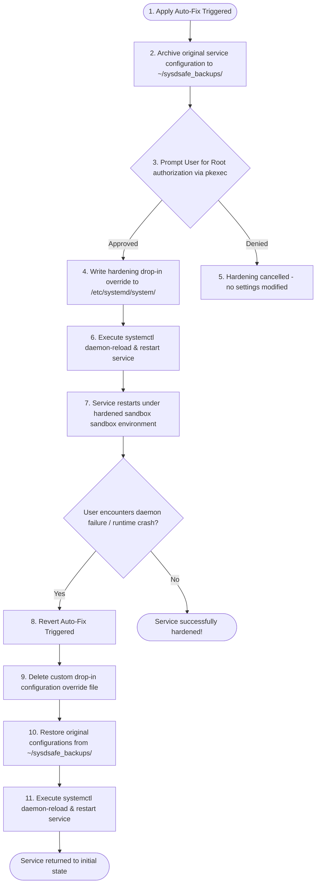
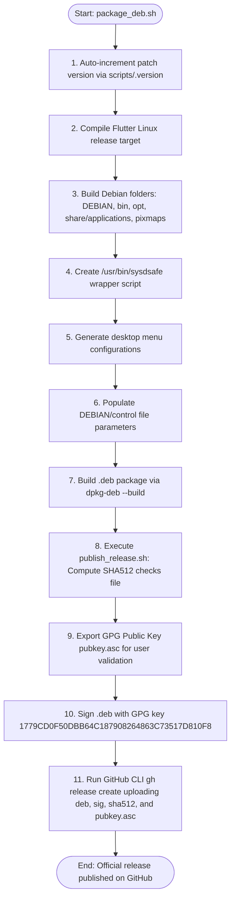

# SysdSafe — Hardening & Release Management Manual

Welcome to **SysdSafe**! This utility is an advanced security auditing and hardening assistant built in Flutter to secure Linux systemd services. 

SysdSafe's core philosophy is **"First, do no harm."** Systemd manages your Linux system's essential init tasks (network, login, hardware daemons). Hardening services blindly can break applications or crash your operating system. SysdSafe helps you review, understand, and apply tailored configurations to minimize attack surfaces without breaking your host.

> [!IMPORTANT]
> **Polkit Authorization & Least Privilege**
> SysdSafe does **not** run as root. The GUI process runs entirely within unprivileged user space. When applying system changes, SysdSafe invokes Polkit (`pkexec`) to escalate permissions surgically, verifying credentials only for writing configuration drop-in files to `/etc/systemd/system/`.

---

## ⚠️ 1. Safety Hardening Philosophy

Every Linux host has a unique environment. We enforce strict safety rules:

1.  **Understand Host Dependencies:** Before locking down a service, examine its needs. Does it require network access? Does it need raw socket access? Does it write to `/var/`?
2.  **Apply Controls Incrementally:** Never lock down multiple system services simultaneously. Audit one service, apply changes, reboot/restart, verify operations, and then move to the next.
3.  **Research Directives:** Avoid applying security options unless you understand their functions (e.g., `ProtectSystem=strict` or `PrivateNetwork=yes`).

---

## 🔒 2. Core Hardening Options

SysdSafe applies service overrides via systemd drop-in configuration files. Key directives include:

| Systemd Hardening Option | Action | Protection Target |
| :--- | :--- | :--- |
| `ProtectSystem=strict` | Mounts the OS directory tree (`/usr`, `/boot`, `/etc`) read-only for the service daemon. | Prevents unauthorized modification of core system binaries. |
| `PrivateNetwork=yes` | Sets up a blank loopback network namespace for the daemon, disabling socket access. | Mitigates remote command execution and data exfiltration. |
| `ProtectHome=yes` | Sandbox-isolates home folders (`/home`, `/root`) from the service runtime. | Safeguards user credentials and personal files. |
| `PrivateDevices=yes` | Filters access to physical hardware devices under `/dev/` (e.g., raw disks, ports). | Prevents direct physical resource manipulation. |
| `NoNewPrivileges=yes` | Prevents the daemon's child processes from gaining elevated permissions (e.g., via `setuid`). | Stops privilege escalation exploits. |

---

## 📥 3. Installation & Setup

SysdSafe is natively distributed and deployed as a system-level Debian package (`.deb`).

### Installation Commands
```bash
# Install the Debian package
sudo dpkg -i sysdsafe_*.deb

# If dependency errors occur, resolve them instantly:
sudo apt-get install -f
```

Upon launch, SysdSafe runs a background scanner across your `/etc/systemd/system/` and `/lib/systemd/system/` tables. Services are categorized into **High**, **Medium**, and **Low** urgency based on risk factors (e.g., processes running as root, lack of sandboxing).

---

## 🔄 4. Auto-Fix, Backup, and Rollback System

To ensure system stability, SysdSafe employs an atomic backup and restore engine:



---

## ⚙️ 5. Technical Stack & Dependencies

SysdSafe utilizes the following package layout:

| Component | Library / Dependency | Role |
| :--- | :--- | :--- |
| **GUI Framework** | Flutter SDK & Dart | Renders the high-performance material interface. |
| **Data Visuals** | `fl_chart` | Displays security risk distributions and threat metrics. |
| **Settings Cache** | `sqflite_common_ffi` | Caches service logs and persistent audit results. |
| **Render Engine** | `flutter_markdown_plus` | Renders parsed service man pages and context inline. |
| **Launcher** | `url_launcher` | Handles external triggers, like opening default email client logs. |

---

## 📝 6. Logging & Technical Support

SysdSafe tracks operations (audits, fixes, reverts) to a local app log file.

*   **Log Destination Path:** `~/.local/state/sysdsafe/app.log`.
*   **In-App Auditor:** View trace entries in real-time in the **Logs** tab.
*   **Support Portal:** If a service fails to restore, navigate to the **Logs** tab and tap **Email Support**. Your default mail system will load with pre-filled support destination fields. Manually attach `~/sysdsafe_backups/` and `app.log` so our team can debug the environment.

---

## 🏗️ 7. Release & Debian Packaging Pipeline

SysdSafe compiles, checksums, and signs release files automatically via internal packaging scripts:



### Released Deliverables
*   **`.deb` Installer:** `sysdsafe_${VERSION}_amd64.deb`
*   **Detached Signature:** `sysdsafe_${VERSION}_amd64.deb.sig`
*   **Checksum Verification:** `sysdsafe_${VERSION}_amd64.deb.sha512`
*   **GPG Public Key:** `pubkey.asc` (used to verify signature authenticity)

To verify the signature manually, download the deliverables and execute:
```bash
# Import the public key
gpg --import pubkey.asc

# Verify the package signature
gpg --verify sysdsafe_*.deb.sig sysdsafe_*.deb
```

---
*SysdSafe is open-source software distributed under the GNU Affero General Public License v3.0 (AGPL-3.0).*
